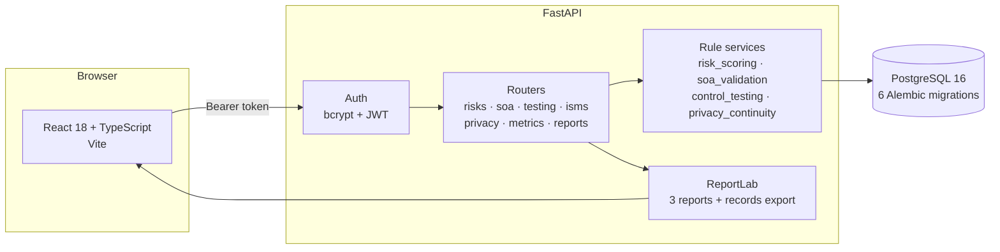
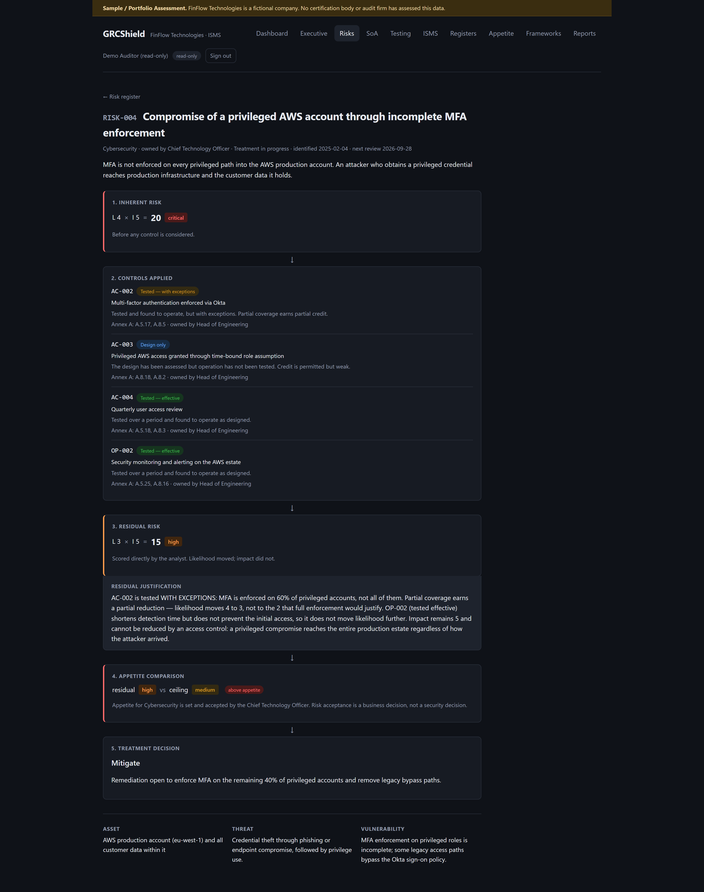
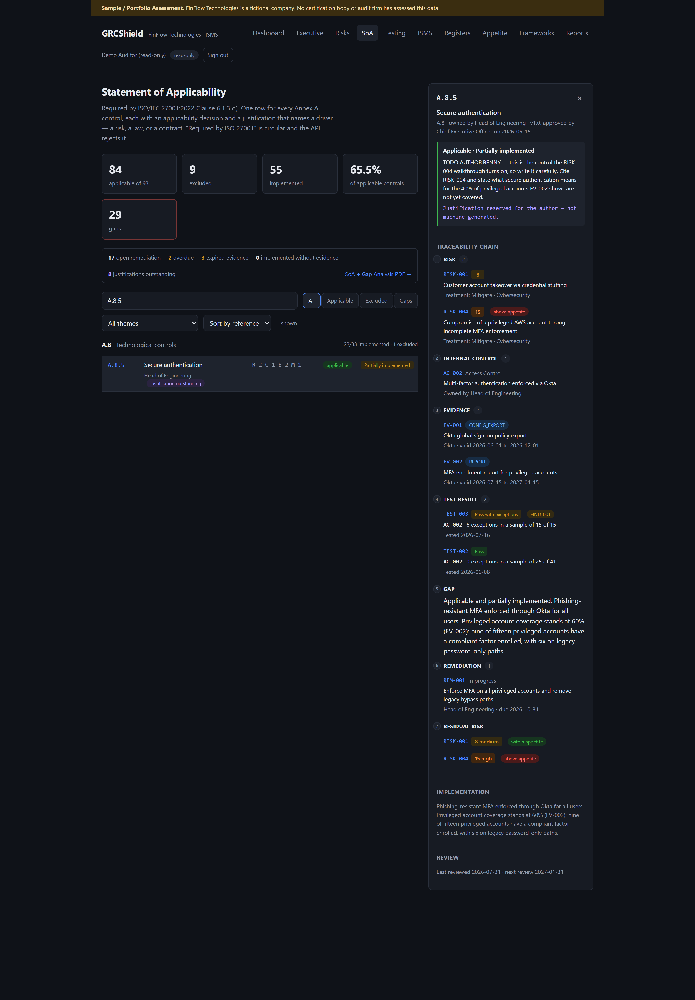
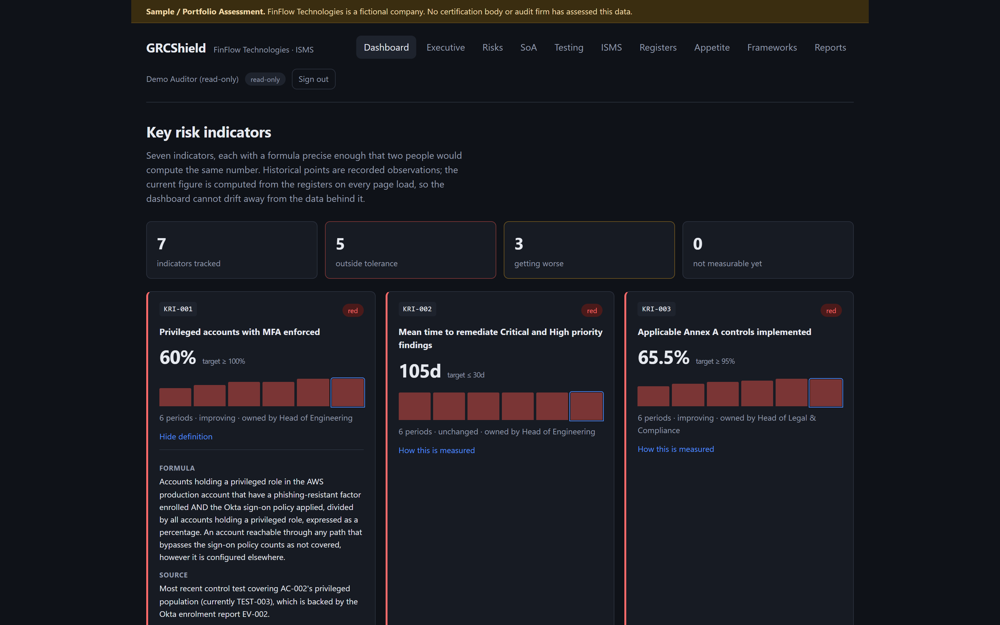
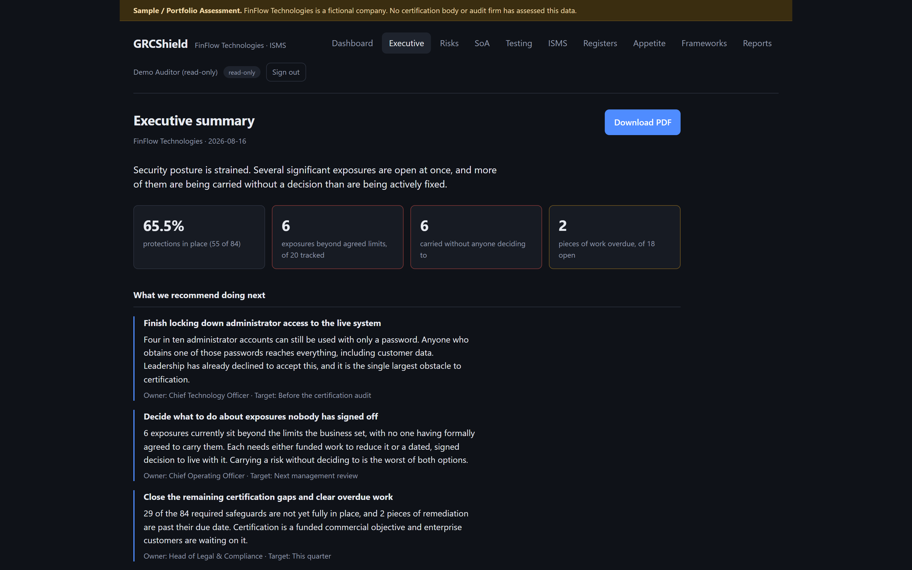

# GRCShield

A Governance, Risk and Compliance platform for **FinFlow Technologies**, a fictional
cloud-native FinTech startup preparing for ISO/IEC 27001:2022 certification.

> **Sample / Portfolio Assessment.** FinFlow Technologies is not a real company. No
> certification body or audit firm has assessed any data in this repository, and no audit
> has been performed. Nothing here is evidence of certification. See
> [Limitations](docs/METHODOLOGY.md#limitations).

---

## The problem this solves

Most risk registers are spreadsheets that quietly lie.

They credit controls nobody has tested. They record risk acceptances with no expiry, so a
decision taken once becomes permanent by default. They exclude controls with "not
applicable" and leave the risk homeless. They compute residual risk by multiplying
inherent risk by an invented effectiveness percentage, which cannot express the fact that
multi-factor authentication reduces *likelihood* and does nothing to *impact*. And they
justify controls with "required by ISO 27001", which explains nothing about the
organisation.

Each of those produces a document that looks like governance and functions as filing. An
auditor finds them in the first hour.

**GRCShield refuses them at the API.** Roughly two dozen business rules return `422` with
the offending field named, and the critical ones are database `CHECK` constraints as well,
so they hold no matter how the data arrives. The seed loader runs the same validators, so
the sample data cannot ship contradicting its own methodology.

---

## The headline feature: one traceable chain

The reason to build this rather than write a spreadsheet is that every claim connects to
the evidence underneath it. **RISK-004** is the worked example, and it spans every module:

```
RISK-004  Privileged AWS compromise through incomplete MFA
   inherent  4 x 5 = 20  Critical
        │
        ├── AC-002  MFA enforced via Okta        basis: TESTED_WITH_EXCEPTIONS
        ├── AC-003  Time-bound elevation          basis: DESIGN_ONLY
        └── OP-002  Security monitoring           basis: TESTED_EFFECTIVE
        │
   residual  3 x 5 = 15  High        ← likelihood moved, impact did not
        │
        ├── Annex A A.8.5  Secure authentication — applicable, partially implemented
        ├── EV-002   MFA enrolment report: 60% privileged coverage
        ├── TEST-003 full population of 15, 6 exceptions, pass with exceptions
        ├── FIND-001 → REM-001, Head of Engineering, due 2026-10-31
        ├── NC-001   Clause 10.2 — correction applied, corrective action in progress
        └── EXC-004  acceptance requested and REFUSED at management review
        │
   appetite  High vs Cybersecurity ceiling of Medium  →  ABOVE APPETITE
   treatment Mitigate
```

`scripts/smoke_test.py` walks that entire chain against a running instance and fails the
build if any link breaks.

**Impact does not move.** No arithmetic model applying a single percentage to a single
score could produce that, and it is the whole argument for scoring residual risk
independently.

---

## Architecture



Rules live in `services/`, separate from both routes and models, so the same validator
runs on an API write, on a seed load, and in a unit test with no database at all.

---

## Running it

```bash
docker compose up --build
```

- **Web** — http://localhost:5173
- **API** — http://localhost:8000 (OpenAPI docs at `/docs`)
- **Health** — http://localhost:8000/health

The API container runs migrations and seeds reference data on start. Seeding is
idempotent, so restarting against an existing volume is safe.

Clean slate:

```bash
docker compose down -v && docker compose up --build
```

### Demo credentials

| Username | Password | Role |
| --- | --- | --- |
| `auditor` | `auditor-demo-2026` | Read everything, change nothing |
| `isms.manager` | `manager-demo-2026` | Read and maintain the registers |

Published deliberately: fictional credentials, fictional company, fictional data. The
sign-in screen offers both as one-click fills.

**Start with the auditor account.** It can read every register and is refused with `403`
on every write path — which is only meaningful because unauthenticated reads are refused
outright.

---

## Screenshots

### Risk detail — the calculation rendered as a chain

Inherent → controls with their effectiveness basis → residual → appetite → treatment.
**Impact does not move**, and the justification says why.



### Statement of Applicability — the traceability drawer

93 controls, filterable by theme and status. The drawer walks A.8.5 from the risks that
drive it through to the residual risk that remains.



### Key risk indicators

Seven indicators, six-month trends, and the formula behind each one a click away.



### Executive summary

The same numbers, for a reader who does not know what Annex A is.



Regenerate them from a running instance with:

```bash
python scripts/capture_screenshots.py --base-url http://localhost:5173
```

---

## What is in it

| | Count | |
| --- | --- | --- |
| Annex A controls | 93 | Official IDs and titles, all four themes |
| SOC 2 criteria | 61 | Mapped *from* ISO, not assessed separately |
| ISO → SOC 2 mappings | 127 | Typed equivalent / partial / supporting |
| Internal controls | 35 | Distinct from the Annex A catalogue |
| Risks | 20 | Across nine categories, 6 above appetite |
| SoA entries | 93 | 84 applicable, 9 excluded, 65.5% implemented |
| Evidence artifacts | 31 | With validity windows; 3 expired |
| Remediation items | 20 | Owner and due date mandatory |
| Control test workpapers | 12 | 8 pass, 3 with exceptions, 1 fail |
| Audit findings | 4 | Auto-created from non-clean tests |
| ISMS records | 8 | Clause 9.2, 9.3 and 10.2 |
| Risk acceptances | 4 | One expired, one refused |
| GDPR records | 8 | 6 RoPA entries, 2 DPIAs |
| BIA processes | 5 | RTO/RPO bounded by MTPD |
| KRIs | 7 | Computed live, six-month trend |
| Reports | 3 | PDF, plus an ISMS records export |

---

## Why this project demonstrates GRC skills

| Competency | Where to look | What it shows |
| --- | --- | --- |
| **Risk assessment** | [METHODOLOGY.md](docs/METHODOLOGY.md), RISK-004 | Asset → threat → vulnerability → likelihood × impact → controls → residual → appetite → treatment, with residual scored independently and justified in writing |
| **Applicability judgment** | [SOA.md](docs/SOA.md), the nine exclusions | Every exclusion names *where the risk went* — transferred to AWS, or redirected to a specific control. Six of fourteen physical controls are kept, because remote work relocates physical risk rather than removing it |
| **Control testing and sampling** | [TESTING.md](docs/TESTING.md), TEST-003 and TEST-008 | Population, sample, selection method and a mandatory rationale. Design and operating effectiveness assessed separately. Preparer/reviewer segregation enforced |
| **Evidence management** | Evidence register, KRI-006 | Validity windows, not just collection dates. An expired provider report currently leaves eight exclusion justifications unsupported, and the tool says so |
| **Gap analysis** | SoA + Gap Analysis report | Applicable-but-not-implemented is a gap, and a gap cannot exist without a remediation item carrying an owner and a due date |
| **Third-party risk** | RISK-010, TP-001 to TP-003 | Three tested-effective vendor controls and **zero** claimed residual reduction, because reading a SOC 2 report does not make a vendor harder to breach |
| **Privacy — RoPA and DPIA** | [REGISTERS.md](docs/REGISTERS.md), DPIA-001 | Article 30 completeness with Chapter V safeguards enforced; a DPIA whose residual rose to High and therefore triggered an Article 36 consultation duty |
| **Audit programme and management review** | [TESTING.md](docs/TESTING.md), ISMS page | Clause 9.2 with a real independence basis, Clause 9.3 enumerating the required inputs, Clause 10.2 keeping correction and corrective action apart |
| **Metrics and KRIs** | [METRICS.md](docs/METRICS.md) | Formulas precise enough to reproduce, direction-aware thresholds, and `NO_DATA` kept distinct from zero |
| **Executive reporting** | Executive summary | Written for a non-technical reader — a test fails the build if a control identifier or the words "Annex A", "residual", "SoA", "inherent" or "KRI" appear in board-facing prose |

### The single best thing to walk someone through

TEST-008 found unmasked customer data in two non-production stores. That rated DP-005
ineffective, which withdrew a credit RISK-008 was claiming, which pushed that risk above
its Data Privacy ceiling, which downgraded A.8.11 from implemented to a gap, which raised
DPIA-001's residual risk to High — which, under Article 36(1), forced its outcome to change
to *consult the supervisory authority*.

Phase 3 reported 56 controls implemented, 28 gaps and 5 risks above appetite. After
testing: **55, 29 and 6**. Those numbers moved because testing found something, which is
what testing is for. The cascade is asserted in
`test_a_failed_test_propagates_to_the_risk_register_and_the_soa`.

---

## Verification

```bash
# 272 tests — rules, API contracts, and the migration chain
cd backend && pytest -q

# Static integrity checks across every register, no database needed
python scripts/check_seed_data.py

# 54 end-to-end checks against a running instance, including the RISK-004 chain
python scripts/smoke_test.py --base-url http://localhost:8000
```

The tests assert the *decisions*, not just that endpoints return 200: 93 controls in the
right theme counts, exactly nine exclusions each carrying a substantive note, no SOC 2
mapping on an excluded control, RISK-004's impact staying at 5 while likelihood falls, an
auditor receiving 403 on every write path, and no control identifier leaking into board
prose.

`tests/test_migrations.py` runs all six migrations empty → head, downgrades back to base
leaving nothing behind, and compares the resulting schema against the model metadata — so
a model change with no matching migration fails the build. That check found nine indexes
present in migrations and absent from the models.

---

## Layout

```
backend/
  alembic/versions/     6 migrations
  app/
    api/routes/         auth, frameworks, risks, soa, testing, isms, privacy, metrics, reports
    core/               settings, password hashing, JWT
    db/                 declarative base, session
    models/             frameworks, controls, risks, SoA, evidence, audit, privacy, KRI, users
    reports/            registry, and the three report renderers
    schemas/            pydantic request and response models
    seed/               every register, plus the loader that validates them
    services/           risk_scoring, soa_validation, control_testing, privacy_continuity,
                        kri_engine, executive
  tests/                272 tests
frontend/
  src/pages/            dashboard, executive, risks, soa, testing, isms, registers, …
scripts/
  check_seed_data.py    static integrity checks
  smoke_test.py         end-to-end verification against a live instance
docs/
  SCOPE.md              framework scope decisions and exclusions
  METHODOLOGY.md        the risk model, vocabulary, and limitations
  SOA.md                applicability rules and the traceability chain
  TESTING.md            design vs operating effectiveness, sampling, clause records
  REGISTERS.md          risk acceptance, RoPA, DPIA, business impact
  METRICS.md            KRIs, the executive view, access control
  DECISIONS.md          eight decision records
SECURITY.md             controls implemented, and known gaps
```

---

## Authorship

AI assistance was used to scaffold this application — the FastAPI and React boilerplate,
the migration files, the CSS, and the first draft of the documentation.

**The methodology decisions are mine.** Scoring residual risk independently rather than
deriving it, refusing credit to untested controls, setting appetite per category, requiring
acceptances to expire, keeping six of the fourteen physical controls, and treating a
deficient design as a cap on operating effectiveness — those are judgment calls with
reasoning attached, and the reasoning is recorded in
[DECISIONS.md](docs/DECISIONS.md).

Around 25 fields carry the literal marker `TODO AUTHOR:BENNY` — five residual
justifications, eight SoA inclusion justifications, four sampling rationales, and the
decision records. They are deliberately unwritten. A justification I cannot defend in
conversation is worse than an obvious gap, so the tool flags them in the API and the UI
rather than filling them with plausible text.

---

## Known limitations

- **`docker compose up` has not been executed.** Docker Desktop crashes at startup on the
  development machine with an unrelated fault. Everything is verified against SQLite
  instead — 272 tests, the migration chain end to end, and 54 smoke checks against a live
  server. The compose file and Dockerfiles are written but unproven, and PostgreSQL-specific
  DDL (native `ENUM` creation in particular) is unexercised.
- **No rate limiting, account lockout, password reset, or audit log of user actions.** See
  [SECURITY.md](SECURITY.md) for the complete list and the reasoning.
- `JWT_SECRET` ships with a published default so the demo needs no configuration. The app
  warns at startup if it is still in use outside development.
- FinFlow is fictional, every rating is illustrative, and no audit was performed.
