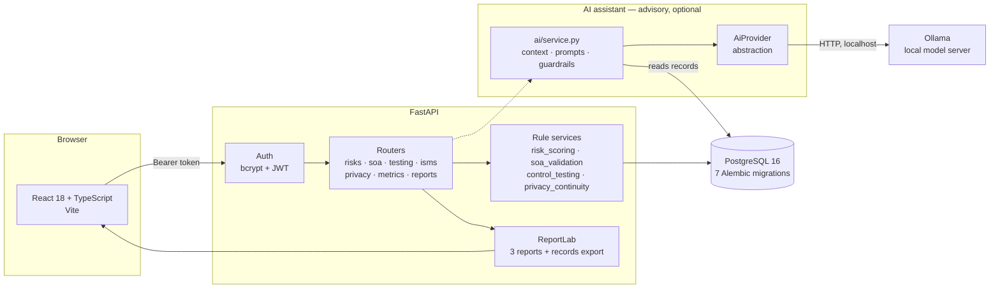

# GRCShield

A Governance, Risk and Compliance platform for **FinFlow Technologies**, a fictional
cloud-native FinTech startup preparing for ISO/IEC 27001:2022 certification.

> **Sample / Portfolio Assessment.** FinFlow Technologies is not a real company. No
> certification body or audit firm has assessed any data in this repository, and no audit
> has been performed. Nothing here is evidence of certification. See
> [Limitations](docs/METHODOLOGY.md#limitations).

---

## The problem this solves

Most risk registers are spreadsheets that quietly lie.

They credit controls nobody has tested. They record risk acceptances with no expiry, so a
decision taken once becomes permanent by default. They exclude controls with "not
applicable" and leave the risk homeless. They compute residual risk by multiplying
inherent risk by an invented effectiveness percentage, which cannot express the fact that
multi-factor authentication reduces *likelihood* and does nothing to *impact*. And they
justify controls with "required by ISO 27001", which explains nothing about the
organisation.

Each of those produces a document that looks like governance and functions as filing. An
auditor finds them in the first hour.

**GRCShield refuses them at the API.** Roughly two dozen business rules return `422` with
the offending field named, and the critical ones are database `CHECK` constraints as well,
so they hold no matter how the data arrives. The seed loader runs the same validators, so
the sample data cannot ship contradicting its own methodology.

---

## The headline feature: one traceable chain

The reason to build this rather than write a spreadsheet is that every claim connects to
the evidence underneath it. **RISK-004** is the worked example, and it spans every module:

```
RISK-004  Privileged AWS compromise through incomplete MFA
   inherent  4 x 5 = 20  Critical
        │
        ├── AC-002  MFA enforced via Okta        basis: TESTED_WITH_EXCEPTIONS
        ├── AC-003  Time-bound elevation          basis: DESIGN_ONLY
        └── OP-002  Security monitoring           basis: TESTED_EFFECTIVE
        │
   residual  3 x 5 = 15  High        ← likelihood moved, impact did not
        │
        ├── Annex A A.8.5  Secure authentication — applicable, partially implemented
        ├── EV-002   MFA enrolment report: 60% privileged coverage
        ├── TEST-003 full population of 15, 6 exceptions, pass with exceptions
        ├── FIND-001 → REM-001, Head of Engineering, due 2026-10-31
        ├── NC-001   Clause 10.2 — correction applied, corrective action in progress
        └── EXC-004  acceptance requested and REFUSED at management review
        │
   appetite  High vs Cybersecurity ceiling of Medium  →  ABOVE APPETITE
   treatment Mitigate
```

`scripts/smoke_test.py` walks that entire chain against a running instance and fails the
build if any link breaks.

**Impact does not move.** No arithmetic model applying a single percentage to a single
score could produce that, and it is the whole argument for scoring residual risk
independently.

---

## Architecture



Rules live in `services/`, separate from both routes and models, so the same validator
runs on an API write, on a seed load, and in a unit test with no database at all.

The dotted arrow is the point of the AI layer. It reads records and returns text beside
them; there is no arrow from it back into the rules or the registers, and there is no
code path that would draw one. The browser never talks to Ollama.

---

## Running it

```bash
docker compose up --build
```

- **Web** — http://localhost:5173
- **API** — http://localhost:8000 (OpenAPI docs at `/docs`)
- **Health** — http://localhost:8000/health

The API container runs migrations and seeds reference data on start. Seeding is
idempotent, so restarting against an existing volume is safe.

Clean slate:

```bash
docker compose down -v && docker compose up --build
```

### Demo credentials

| Username | Password | Role |
| --- | --- | --- |
| `auditor` | `auditor-demo-2026` | Read everything, change nothing |
| `isms.manager` | `manager-demo-2026` | Read and maintain the registers |

Published deliberately: fictional credentials, fictional company, fictional data. The
sign-in screen offers both as one-click fills.

**Start with the auditor account.** It can read every register and is refused with `403`
on every write path — which is only meaningful because unauthenticated reads are refused
outright.

---

## Screenshots

### Risk detail — the calculation rendered as a chain

Inherent → controls with their effectiveness basis → residual → appetite → treatment.
**Impact does not move**, and the justification says why.


### Statement of Applicability — the traceability drawer

93 controls, filterable by theme and status. The drawer walks A.8.5 from the risks that
drive it through to the residual risk that remains.


### Key risk indicators

Seven indicators, six-month trends, and the formula behind each one a click away.


### Executive summary

The same numbers, for a reader who does not know what Annex A is.


Regenerate them from a running instance with:

```bash
python scripts/capture_screenshots.py --base-url http://localhost:5173
```

---

## What is in it

| | Count | |
| --- | --- | --- |
| Annex A controls | 93 | Official IDs and titles, all four themes |
| SOC 2 criteria | 61 | Mapped *from* ISO, not assessed separately |
| ISO → SOC 2 mappings | 127 | Typed equivalent / partial / supporting |
| Internal controls | 35 | Distinct from the Annex A catalogue |
| Risks | 20 | Across nine categories, 7 above appetite |
| SoA entries | 93 | 84 applicable, 9 excluded, 65.5% implemented |
| Evidence artifacts | 31 | With validity windows; 3 expired |
| Remediation items | 20 | Owner and due date mandatory |
| Control test workpapers | 12 | 8 pass, 3 with exceptions, 1 fail |
| Audit findings | 4 | Auto-created from non-clean tests |
| ISMS records | 8 | Clause 9.2, 9.3 and 10.2 |
| Risk acceptances | 4 | One expired, one refused |
| GDPR records | 8 | 6 RoPA entries, 2 DPIAs |
| BIA processes | 5 | RTO/RPO bounded by MTPD |
| KRIs | 7 | Computed live, six-month trend |
| Reports | 3 | PDF, plus an ISMS records export |
| AI assistants | 7 | Local, advisory, and unable to change any of the above |

---

## Why this project demonstrates GRC skills

| Competency | Where to look | What it shows |
| --- | --- | --- |
| **Risk assessment** | [METHODOLOGY.md](docs/METHODOLOGY.md), RISK-004 | Asset → threat → vulnerability → likelihood × impact → controls → residual → appetite → treatment, with residual scored independently and justified in writing |
| **Applicability judgment** | [SOA.md](docs/SOA.md), the nine exclusions | Every exclusion names *where the risk went* — transferred to AWS, or redirected to a specific control. Six of fourteen physical controls are kept, because remote work relocates physical risk rather than removing it |
| **Control testing and sampling** | [TESTING.md](docs/TESTING.md), TEST-003 and TEST-008 | Population, sample, selection method and a mandatory rationale. Design and operating effectiveness assessed separately. Preparer/reviewer segregation enforced |
| **Evidence management** | Evidence register, KRI-006 | Validity windows, not just collection dates. An expired provider report currently leaves eight exclusion justifications unsupported, and the tool says so |
| **Gap analysis** | SoA + Gap Analysis report | Applicable-but-not-implemented is a gap, and a gap cannot exist without a remediation item carrying an owner and a due date |
| **Third-party risk** | RISK-010, TP-001 to TP-003 | Three tested-effective vendor controls and **zero** claimed residual reduction, because reading a SOC 2 report does not make a vendor harder to breach |
| **Privacy — RoPA and DPIA** | [REGISTERS.md](docs/REGISTERS.md), DPIA-001 | Article 30 completeness with Chapter V safeguards enforced; a DPIA whose residual rose to High and therefore triggered an Article 36 consultation duty |
| **Audit programme and management review** | [TESTING.md](docs/TESTING.md), ISMS page | Clause 9.2 with a real independence basis, Clause 9.3 enumerating the required inputs, Clause 10.2 keeping correction and corrective action apart |
| **Metrics and KRIs** | [METRICS.md](docs/METRICS.md) | Formulas precise enough to reproduce, direction-aware thresholds, and `NO_DATA` kept distinct from zero |
| **Executive reporting** | Executive summary | Written for a non-technical reader — a test fails the build if a control identifier or the words "Annex A", "residual", "SoA", "inherent" or "KRI" appear in board-facing prose |

### The single best thing to walk someone through

TEST-008 found unmasked customer data in two non-production stores. That rated DP-005
ineffective, which withdrew a credit RISK-008 was claiming, which pushed that risk above
its Data Privacy ceiling, which downgraded A.8.11 from implemented to a gap, which raised
DPIA-001's residual risk to High — which, under Article 36(1), forced its outcome to change
to *consult the supervisory authority*.

Phase 3 reported 56 controls implemented, 28 gaps and 5 risks above appetite. After
testing: **55, 29 and 6**. Those numbers moved because testing found something, which is
what testing is for. The cascade is asserted in
`test_a_failed_test_propagates_to_the_risk_register_and_the_soa`.

---

## Local AI with Ollama

An optional assistant, running entirely on your own machine. It helps a GRC analyst
think; it does not do their job, and it cannot make a decision this system records.

**The whole feature is optional.** With `AI_ENABLED=false`, or with Ollama simply not
running, every register, report, validation rule and screen behaves exactly as it does
without it. That is asserted rather than asserted-to: the smoke test passes 66 checks
with Ollama running and 62 with it stopped, and the difference is only the checks that
exist to test the assistant itself.

### What the AI is doing

Seven tasks, each tied to a record already in the system:

| Assistant | Where | What it produces |
| --- | --- | --- |
| Risk | Risk detail | Threat scenarios, vulnerabilities, control areas, questions to investigate, treatment options |
| Risk description | Risk detail | A risk statement as threat → vulnerability → event → impact |
| Control mapping | Risk detail | Annex A controls to consider, checked against the real catalogue |
| Control testing | Workpaper drawer | Evidence as described, possible exceptions, missing evidence, follow-up questions |
| Audit finding | Workpaper drawer | Draft condition, criteria, risk and impact, possible root causes |
| Remediation | Findings tab | Correction and corrective action, separately, and what closing would take |
| Policy / procedure | ISMS records | Drafts written against FinFlow's actual scope |

### Architecture

```
React                      the browser never talks to Ollama
  │  POST /ai/...          bearer token, same auth as everything else
  ▼
FastAPI  app/api/routes/ai.py
  ▼
AIService  app/services/ai/service.py
  ├── context.py      what the model is allowed to see — per task, named fields only
  ├── prompts.py      what it is told — assembled server-side from constants
  ├── response.py     what it is allowed to answer — a Pydantic schema, enforced twice
  └── guardrails.py   fencing in, claim checking out
  ▼
AiProvider  (abstraction — swap the runtime, change one line of wiring)
  ▼
OllamaProvider  app/services/ai/ollama.py   the only module that knows Ollama exists
  ▼
Ollama on localhost:11434
```

### Installation

1. Install Ollama from <https://ollama.com/download>.
2. Pull a model:

```bash
ollama pull llama3.2:3b
```

3. Start the server, if the desktop app has not already:

```bash
ollama serve
```

Nothing is downloaded automatically. A model is a multi-gigabyte file and pulling one is
your decision, so the application reports that the configured model is missing and tells
you the command, rather than fetching it.

### Configuring the model

Any model Ollama holds. Nothing in the code depends on a particular one.

```bash
OLLAMA_MODEL=llama3.2:3b   # or mistral, qwen2.5, gpt-oss:20b …
```

`GET /ai/status` reports which of two different problems you have, because they need
different fixes:

```
Ollama is not reachable at http://localhost:11434. Start it with 'ollama serve'.
Ollama is running, but the configured model 'llama3.2:3b' is unavailable.
  Pull it with 'ollama pull llama3.2:3b', or set OLLAMA_MODEL to one that is
  present: gpt-oss:20b, qwen3-coder:30b.
```

### Environment variables

| Variable | Default | What it does |
| --- | --- | --- |
| `AI_ENABLED` | `true` | Master switch. `false` disables every assistant endpoint cleanly. |
| `OLLAMA_BASE_URL` | `http://localhost:11434` | Warned at start-up if it is not loopback or private. |
| `OLLAMA_MODEL` | `llama3.2:3b` | A default, not an assumption. |
| `OLLAMA_TIMEOUT` | `60` | Seconds. A timeout is a 503 and an explanation. |
| `OLLAMA_NUM_CTX` | `8192` | Ollama defaults to 4096 whatever the model supports, and truncates in silence. |
| `AI_MAX_INPUT_CHARS` | `12000` | Ceiling on record content in one prompt. |
| `AI_MAX_QUESTION_CHARS` | `500` | Ceiling on the analyst's free-text question. |
| `AI_STATUS_CACHE_SECONDS` | `30` | The status chip is on every page; it must not poll a model server. |
| `AI_STRUCTURED_OUTPUT` | `true` | Send the response JSON schema as the generation format. |

All of them are in [`.env.example`](.env.example) with the reasoning attached.

### Running GRCShield with AI

```bash
ollama serve                       # terminal 1
docker compose up --build          # terminal 2
```

From inside Docker, set `OLLAMA_BASE_URL=http://host.docker.internal:11434`; Ollama is on
the host, not in the compose network. Running the backend directly, the default is right.

The masthead carries a status chip: **AI: connected · llama3.2:3b**, or **AI: offline**
with the detail on hover. Each assistant is a collapsed panel that does nothing until
you open it.

### What the AI can and cannot do

It can summarise, question, explain, suggest and draft.

It cannot — and this is enforced in three independent places, not requested in a prompt:

| The rule | Where it is enforced |
| --- | --- |
| No score, band, conclusion, effectiveness rating, severity, approval, owner or date | The response schema has no field that could carry one. `test_no_ai_response_model_can_express_a_grc_decision` walks every field of every response model and fails the build if one appears. |
| No write to any register | There is no code path from `routes/ai.py` to a register write. `test_the_assistant_changes_no_grc_record` calls every endpoint and compares eight register endpoints byte for byte before and after. |
| No claim of compliance, certification, verification or a test verdict | Output guardrails scan the model's own words, flag the claim to the analyst, and record it in the interaction log. |

Every response carries `advisory: true`, `requires_human_review: true`, the list of what
the model was shown, and a link to its logged interaction. Those three are constants in
the envelope, not values the model can influence.

The one deliberate departure from the existing authorisation rule: the AI router is
mounted on `current_user` rather than `require_write`. `require_write` decides what is a
mutation by HTTP method, which is right for every other router and wrong for this one —
these are POSTs because a risk record does not fit in a query string. A read-only auditor
asking an assistant to summarise a workpaper is the read-only case, not an exception to
it. The reasoning is at the top of `app/api/routes/ai.py`, and a test asserts both halves:
the auditor can use the assistant, and the auditor still gets `403` on every register
write.

### Security and privacy

**Inference is local, and that is the reason for choosing Ollama.** An ISMS is a
catalogue of an organisation's weaknesses — accepted risks, failed control tests, DPIA
findings. Sending that to a third-party inference API would be a processing activity in
its own right, needing a lawful basis, a RoPA entry, a transfer assessment and a supplier
review. Keeping inference local removes the question rather than answering it.

- **Context is built, not dumped.** Each task assembles its own context from named
  fields. `test_context_never_carries_a_credential` asserts the rendered prompt contains
  no password hash, no signing key and no database URL, checked against the real values
  rather than against field names.
- **Prompt injection.** Record content is free text somebody typed, so it is fenced,
  labelled, and preceded by a system prompt that says instructions inside a fence are
  never followed. A record cannot close its own fence. No filter tries to detect
  attack phrasing — "ignore all previous instructions" is legitimate text for a risk
  *about* prompt injection, and a filter would corrupt the record while missing the next
  phrasing.
- **No user-supplied prompts.** The system message is assembled from constants. Requests
  use `extra="forbid"`, so `{"system_prompt": "..."}` is a `422` rather than a field
  quietly ignored.
- **The log stores no prompt and no response.** Every prompt is built from records this
  database already holds under their own access control; a second copy in a log table
  would add exposure without adding assurance. What is stored is who, when, which
  feature, which record, which model, what happened, and a truncated SHA-256 digest — so
  a suggestion someone pasted into a workpaper can be tied back to the interaction that
  produced it, without retaining the text of either.
- **Ollama is treated as external** even though it is local: bounded timeouts, typed
  failures, no assumption the response is well-formed, no assumption the server is there.
- **Do not expose Ollama to the internet.** It has no authentication of its own. The app
  logs a warning at start-up if `OLLAMA_BASE_URL` is not loopback or private.

### Troubleshooting

| Symptom | Cause | Fix |
| --- | --- | --- |
| Chip says **AI: offline** | Ollama is not running | `ollama serve` |
| Chip says **AI: model unavailable** | The model is not pulled | `ollama pull <model>`, or set `OLLAMA_MODEL` to one listed in `/ai/status` |
| Chip is absent | `AI_ENABLED=false` | Set it to `true` and restart |
| `503` on an assistant, everything else fine | Ollama stopped or timed out | Working as designed. Start Ollama, or raise `OLLAMA_TIMEOUT` |
| `502` "did not return a JSON object" | The model ignores structured output | Try a different model; small ones are less reliable at this |
| First request takes 30s or more | Cold model load | Normal. Ollama keeps the model resident afterwards |
| Suggestions are thin, or control mapping returns nothing | The model is too small for the task | Control mapping asks a model to select from 93 controls. See the limitation below |
| Docker: assistant unreachable | Ollama is on the host | `OLLAMA_BASE_URL=http://host.docker.internal:11434` |

---

## Verification

```bash
# 372 tests — rules, API contracts, the migration chain, and the AI layer
cd backend && pytest -q

# Static integrity checks across every register, no database needed
python scripts/check_seed_data.py

# 62 end-to-end checks against a running instance, including the RISK-004 chain
# (66 when Ollama is running — the extra four exercise the assistant)
python scripts/smoke_test.py --base-url http://localhost:8000
```

The AI tests never contact Ollama. The provider boundary exists so a stub can answer
instead, which is also the only way to test the cases that matter: a model returning
prose where JSON was asked for, a model claiming the organisation is certified, a model
citing a control identifier from the 2013 edition.

The tests assert the *decisions*, not just that endpoints return 200: 93 controls in the
right theme counts, exactly nine exclusions each carrying a substantive note, no SOC 2
mapping on an excluded control, RISK-004's impact staying at 5 while likelihood falls, an
auditor receiving 403 on every write path, and no control identifier leaking into board
prose.

`tests/test_migrations.py` runs all seven migrations empty → head, downgrades back to base
leaving nothing behind, and compares the resulting schema against the model metadata — so
a model change with no matching migration fails the build. That check found nine indexes
present in migrations and absent from the models.

---

## Layout

```
backend/
  alembic/versions/     7 migrations
  app/
    api/routes/         auth, frameworks, risks, soa, testing, isms, privacy, metrics,
                        reports, ai
    core/               settings, password hashing, JWT
    db/                 declarative base, session
    models/             frameworks, controls, risks, SoA, evidence, audit, privacy, KRI,
                        users, ai
    reports/            registry, and the three report renderers
    schemas/            pydantic request and response models
    seed/               every register, plus the loader that validates them
    services/           risk_scoring, soa_validation, control_testing, privacy_continuity,
                        kri_engine, executive
      ai/               provider, ollama, context, prompts, response, guardrails, service
  tests/                372 tests
frontend/
  src/pages/            dashboard, executive, risks, soa, testing, isms, registers, …
  src/ai.ts             the assistant's API client
  src/AiAssistant.tsx   the assistant panel and the masthead status chip
scripts/
  check_seed_data.py    static integrity checks
  smoke_test.py         end-to-end verification against a live instance
docs/
  SCOPE.md              framework scope decisions and exclusions
  METHODOLOGY.md        the risk model, vocabulary, and limitations
  SOA.md                applicability rules and the traceability chain
  TESTING.md            design vs operating effectiveness, sampling, clause records
  REGISTERS.md          risk acceptance, RoPA, DPIA, business impact
  METRICS.md            KRIs, the executive view, access control
  DECISIONS.md          nine decision records
SECURITY.md             controls implemented, and known gaps
```

---

## Authorship

AI assistance was used to scaffold this application — the FastAPI and React boilerplate,
the migration files, the CSS, and the first draft of the documentation.

**The methodology decisions are mine.** Scoring residual risk independently rather than
deriving it, refusing credit to untested controls, setting appetite per category, requiring
acceptances to expire, keeping six of the fourteen physical controls, and treating a
deficient design as a cap on operating effectiveness — those are judgment calls with
reasoning attached, and the reasoning is recorded in
[DECISIONS.md](docs/DECISIONS.md).

Around 25 fields carry the literal marker `TODO AUTHOR:BENNY` — five residual
justifications, eight SoA inclusion justifications, four sampling rationales, and the
decision records. They are deliberately unwritten. A justification I cannot defend in
conversation is worse than an obvious gap, so the tool flags them in the API and the UI
rather than filling them with plausible text.

---

## Known limitations

- **`docker compose up` has not been executed.** Docker Desktop crashes at startup on the
  development machine with an unrelated fault. Everything is verified against SQLite
  instead — 372 tests, the migration chain end to end, and 62 smoke checks against a live
  server (66 with Ollama running). The compose file and Dockerfiles are written but unproven, and PostgreSQL-specific
  DDL (native `ENUM` creation in particular) is unexercised.
- **No rate limiting, account lockout, password reset, or audit log of user actions.** See
  [SECURITY.md](SECURITY.md) for the complete list and the reasoning.
- **The assistant is only as good as the model behind it.** Verified end to end against
  Ollama 0.14.2 with `llama3.2:3b`. The risk, testing, finding and remediation assistants
  produce useful text on that model. **Control mapping is unreliable on a 3B model** — it
  is asked to select from 93 controls, and on repeated runs it returned anything from
  four sensible suggestions to an empty list. The catalogue check catches the wrong
  answers; it cannot manufacture right ones. A larger model is the fix, and `gpt-oss:20b`
  was too slow to be interactive on the development machine (CPU-only inference, minutes
  per request). The size of that gap is stated rather than hidden because it is the
  honest state of local inference on a laptop.
- **No rate limiting on the assistant endpoints.** Request size is bounded, and the model
  server is local, so the exposure is a slow endpoint rather than a bill. It would still
  be the first thing to add before this ran anywhere shared.
- **The interaction log is append-only and never pruned.** Fine at demo volume; it needs
  a retention rule before it is a real deployment.
- `JWT_SECRET` ships with a published default so the demo needs no configuration. The app
  warns at startup if it is still in use outside development.
- FinFlow is fictional, every rating is illustrative, and no audit was performed.
